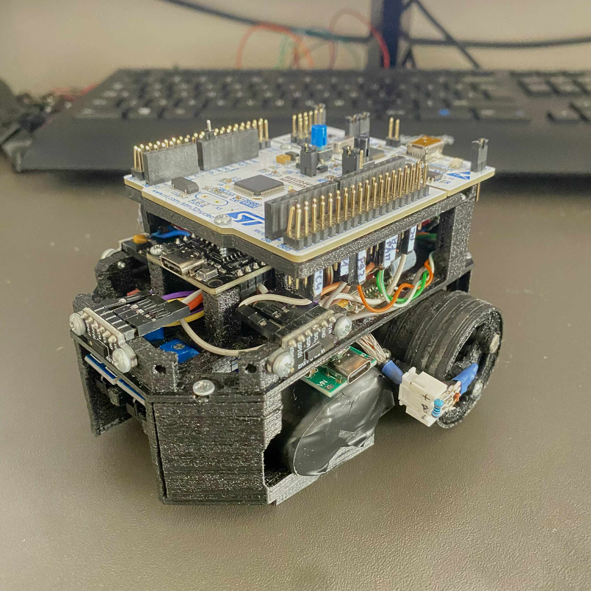
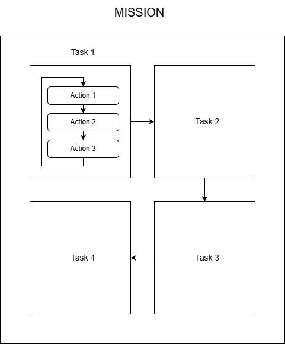

# STM32 Robot Platform

Modular robot platform for experimenting with basic robotics. Built around STM32F411RE (main controller) and ESP32 (encoder bridge + web interface).



## Hardware

The platform uses 3D-printed chassis designed for modularity and easy prototyping. It is possible to configure sensor layer by suppressing/unsuppressing features. All parts are available as Fusion 360 files (`.f3z`) in the `hardware/` directory.

**Components:**

- STM32F411RE Nucleo board
- ESP32 DevKit
- TB6612FNG motor driver
- 2× 130 DC 3-6 V motors with custom 36:1 planetary gearboxes
- 3× VL53L0X time-of-flight sensors
- 2× DRV5032FCDBZR hall effect sensors for wheel encoders (see notes below)
- 2× TCRT5000 tracking sensors (not currently implemented)
- User button on PC0 (not currently implemented)
- MINI360 DC-DC step down buck converter (logic circuit)
- XL4015 DC-DC step down buck converter (power circuit)
- 18650 2S 15C Li-Ion battery pack

**Pinout:**

| **STM32 Pin** | **Function** |
|---------------|--------------|
| PA9, PA10 | UART TX/RX (ESP32 communication) |
| PB0, PB1 | Motor PWM (right, left) |
| PA4, PB2 | Motor A direction (IN1, IN2) |
| PA11, PA12 | Motor B direction (IN2, IN1) |
| PC1, PA6 | TCRT sensors (right, left) |
| PB8, PB9 | I2C1 SCL/SDA (VL53L0X) |
| PC4, PC5, PC2 | VL53L0X XSHUT (left, center, right) |
| PC0 | User button (reserved for future use) |

| **ESP32 Pin** | **Function** |
|---------------|--------------|
| D16, D17 | UART2 TX/RX (STM32 communication) |
| D4, D13 | Encoder interrupts (left, right) |

## Architecture

The firmware is structured around a mission-based task scheduler running as the main thread, periodically updating available tasks. Each mission consists of multiple tasks, with each task containing a sequence of actions that can be combined to create autonomous behaviors.



**Mission Architecture Flow:**
- Missions are queued in the scheduler and executed sequentially
- Each mission contains one or more tasks
- Tasks are broken down into actions (DriveDistance, Measure, WallFollow) that are serviced periodically
- Actions report completion status, allowing the scheduler to advance to the next step
- Failed actions trigger error handling and mission cancellation

**Available Actions:**
- `DriveDistance` — drives to set heading (degrees) for a specified distance (mm) at set speed (mm/s) using encoder feedback and odometry
- `Measure` — reads selected VL53L0X sensors
- `WallFollow` — follows a wall (left/right/center) at set speed (%) maintaining set offset distance using PID control

Missions are defined as semicolon-delimited strings sent via CLI or web interface. The mission scheduler executes actions sequentially.

**Communication Protocol:**

A custom binary protocol over UART between STM32 and ESP32 uses the following message structure:

```
[CMD_BYTE:1][ARG_COUNT:1][ARGS:n][\n]
```

- **CMD_BYTE**: 8-bit value containing command ID (7 bits) and direction bit (1 bit)
  - Bit 0: Direction (0=request, 1=response)
  - Bits 1-7: Command ID
- **ARG_COUNT**: Number of bytes in the arguments section
- **ARGS**: Raw argument data string (optional)
- **\n**: Message delimiter

## Control Panel Webpage

The web interface provides button-based command formation with two modes: instant send (commands execute immediately with field values) or manual construction via the custom command field (command buttons prefill this field). Mission builder allows creating multi-action sequences by adding tasks like "Measure" and "Wall Follow" with configurable parameters. All sent commands and debug messages from the STM32 are displayed in the real-time log panel. See `docs/Control_Panel.png`

## Software Architecture

```
stm32/                   # STM32 firmware
├── Application/
│   ├── Action/          # Action implementations
│   ├── Config/          # Hardware abstraction configs
│   ├── main.c
│   ├── mission_app.c    # Mission scheduler
│   ├── kinematics_app.c # Motor control, odometry
│   └── esp_comm_app.c   # ESP32 communication handler
├── Framework/           # PDF framework (submodule)
└── ThirdParty/          # STM32 HAL, FreeRTOS

esp32/                   # ESP32 firmware (PlatformIO)
├── src/                 # Main source
│   ├── main.cpp
│   ├── encoder.cpp      # Hall sensor interrupt handling
│   └── esp_protocol.cpp # UART protocol implementation
├── lib/                 # Web server, WiFi, logging
└── data/                # Web interface files (served via LittleFS)
```

**Dependencies:**
- STM32 firmware uses PDF (Platform Driver Framework) as a hardware abstraction layer, included as a git submodule from [github.com/Pofkinas/pdf](https://github.com/Pofkinas/pdf)
- ESP32 uses file system (LittleFS) to house web page, included as library dependency from [github.com/joltwallet/esp_littlefs](https://github.com/joltwallet/esp_littlefs.git#v1.20.3)

## Odometry & Kinematics

The `kinematics_app` tracks robot position and heading using differential drive equations. Encoder data from ESP32 (wheel RPM) is converted to linear and angular velocity, then integrated to estimate:
- X/Y position (mm) in global frame
- Heading angle (degrees)
- Velocity (mm/s)

## CLI Commands

The STM32 exposes a command-line interface via UART. Commands can be sent from a serial terminal or via the web interface. Alternatively, enable the CLI by defining `ENABLE_CLI` in `platform_config.h` and setting `DEBUG_UART` to `UART2` (ST-Link). Note that enabling CLI on the debug UART will disable debug message forwarding to the Robot Control Panel webpage.

See `stm32/Application/custom_cli_lut.c` for complete command list and syntax.

## VL53L0X Time-of-Flight Sensors

The robot uses three VL53L0X sensors operating in a custom high-speed, high-accuracy profile. On boot, the firmware performs automatic calibration (offset and crosstalk) to compensate for environmental conditions.

**Calibration Process:**
- Place robot in similar operating conditions with white calibration targets perpendicular to sensors at 100 mm distance
- Power on and wait for calibration to complete (~15 seconds)
- View calibration values printed in Robot Platform Control Panel

To disable the calibration process, set `.has_calib_data` to `true` in `stm32/Application/Config/vl53l0xv2_config.c` for each sensor and prefill calibration values from a previous calibration run (printed via debug UART).

## Build & Flash

When cloning/forking repo, init PDF submodules via:
```bash
git submodule update --init --recursive
```

**STM32:**
- Import `stm32/` as "Existing project" into Workspace in STM32CubeIDE
- Build and flash via ST-Link

**ESP32:**
- Install PlatformIO
- Navigate to `esp32/` and run `pio run -t upload`
- Upload filesystem: `pio run -t uploadfs`

**Web Interface:**
- Connect ESP32 to WiFi network (enter credentials in `esp32/include/config.h`)
- Using a serial console (baudrate 115200), reboot the ESP32 and watch logs for the hosted IP address
- Navigate to the ESP32's IP address in a browser

## PID Wall-Follow Tuning

The wall-follow action uses a PID controller to maintain a target distance from walls. Motor speed imbalance is partly offset by proportional value `MOTOR_x_SPEED_OFFSET` in `stm32\Application\Config\motor_config.h`.

**Quick tuning procedure:**
1. Start with Ki = 0, Kd = 0
2. Increase Kp until the robot oscillates, then reduce by 30-50%
3. Add Kd to dampen oscillation and reduce overshoot
4. Add minimal Ki to eliminate steady-state drift

## Known Issues

**Hall sensor choice:** The current hall sensors are practically unusable in encoder applications because of their low sampling rate of only 5 Hz. Consider upgrading to at least 1 kHz sampling rate **omnipolar non-latching** sensors. It is possible to embed magnets while printing in `Planet carrier middle`, removing the need for external encoder arm and fitting everything in a smaller footprint. Though for this case use sensors with at least 5 kHz (~12000 rpm / 6 (first stage gear ratio 6:1) × 3 magnets / 60) sampling rate.

**Wall-follow task:** Current implementation uses sensor data to calculate error for the PID controller, which directly adjusts motor speed (%). A better approach would be to control heading via the kinematics app. This primitive solution was a workaround for unreliable encoder sensors.

**ESP protocol:** Current implementation is overly complicated and confusing. Consider using dedicated bytes for actual commands instead of strings with byte count, plus adding error checking mechanisms (CRC, checksums).

**Motor RPM control:** Due to unusable encoders, motor RPM control and every component based on it (`motor_api` RPM control, `kinematics_app`, `drive_distance` action) remains poorly tested and may not function as intended.

**Motor calibration:** Motor imbalance is currently offset by proportional values (`MOTOR_A_SPEED_OFFSET` / `MOTOR_B_SPEED_OFFSET`). A polynomial calibration curve would be more accurate across the speed range.

## License

This project is licensed under the GNU General Public License v3.0. See the [LICENSE](LICENSE) file for more details
